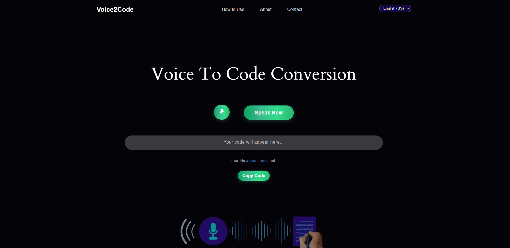
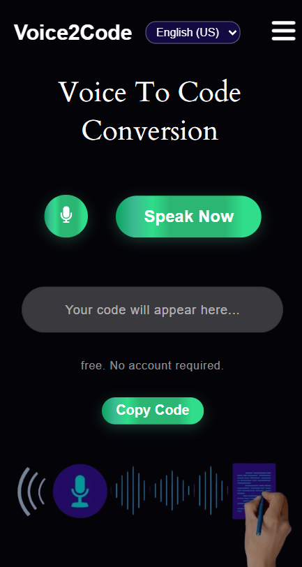

# 🎙️ Voice2Code – Speak. Generate. Code.

**Voice2Code** is an AI-powered web app that lets you convert voice commands into fully functional HTML, CSS, and JavaScript code in real time no typing, no delay, just speak and build.

---

## 🚀 What is Voice2Code?

Imagine coding without touching the keyboard. Just say:

🗣️ *“Create a centered login form with two input fields and a submit button”*  
And boom 💥 the code appears instantly.

**Voice2Code** uses:
- Real-time speech recognition  
- OpenAI's powerful code generation  
- A simple web interface  
To turn your voice into front-end code like magic ✨

---

## 🧠 Features

✅ Real-time speech-to-code generation  
✅ OpenAI Codex/GPT integration  
✅ HTML/CSS/JS code output  
✅ Copy button to grab code instantly  
✅ Fully responsive design-ready layout  
✅ Built using Node.js, Express, HTML, JS

---

## 📸 Screenshot

*(Coming Soon: Live GIF demo of speaking → code)*

---

## 🛠️ Tech Stack

| Layer      | Technology Used               |
|------------|-------------------------------|
| Frontend   | HTML, CSS, JavaScript         |
| Backend    | Node.js, Express              |
| AI Engine  | OpenAI GPT (text-davinci-003) |
| Voice      | Web Speech API (JavaScript)   |
| Styling    | Custom CSS (Tailwind optional)|

---

## 📁 Folder Structure

```
voice2code/
├── public/
│   ├── index.html
│   ├── style.css
│   └── script.js
├── server/
│   └── server.js
├── .env
├── package.json
└── README.md
```

---

## ⚙️ Setup Instructions

1. **Clone the Repository**
```bash
git clone https://github.com/your-username/voice2code.git
cd voice2code
```

2. **Install Backend Dependencies**
```bash
npm install
```

3. **Create a `.env` File**
```
OPENAI_API_KEY=sk-xxxxxxxxxxxxxxxxxxxxxxxxxxxxxxxx
```

4. **Run the Server**
```bash
node server/server.js
```

5. **Open the App**
Just open `public/index.html` in your browser and click 🎙️  
Say something like “Create a red button that says Subscribe” → your code will appear instantly!

---

<h2 align="center">🎥 Preview the Magic</h2>

<p align="center">
  
  
</p>

## 💡 Example Voice Commands

Try saying:

- “Create a responsive navbar with three links”
- “Add a dark theme background and a login card”
- “Make a centered contact form with name, email, and message fields”
- “Design a heading and a paragraph with padding and margins”

---

## ✨ Planned Features

- [ ] Syntax highlighting with Prism.js  
- [ ] Code export/download as `.html`  
- [ ] UI redesign using Tailwind or Bootstrap  
- [ ] Multi-language speech recognition  
- [ ] React version for developers  
- [ ] Live deployed demo link  

---

## 📣 Why Use Voice2Code?

This tool makes front-end prototyping faster and more accessible.  
Whether you're a beginner, a rapid prototyper, or just curious about voice + AI, Voice2Code brings something rare and powerful to the table.

---

## 🤝 Contribute

Want to contribute to this voice+AI revolution?  
Pull requests are welcome! 💥  
You can:
- Improve UI  
- Add backend enhancements  
- Suggest better prompt engineering  
- Submit bug fixes  

---

## ⭐ Like It? Star It!

If you love the idea of coding with your voice, don’t forget to ⭐ this repository.  
Let’s build the future of voice-driven coding together!
---

Made with 💻 + 🧠 + 🎙️  
by Ayesha
